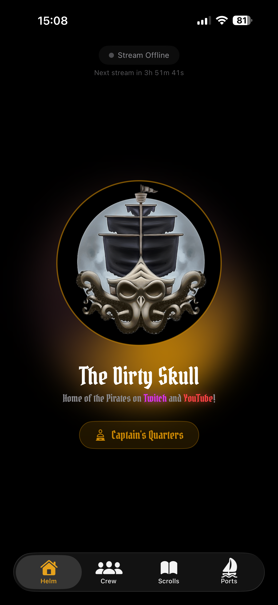
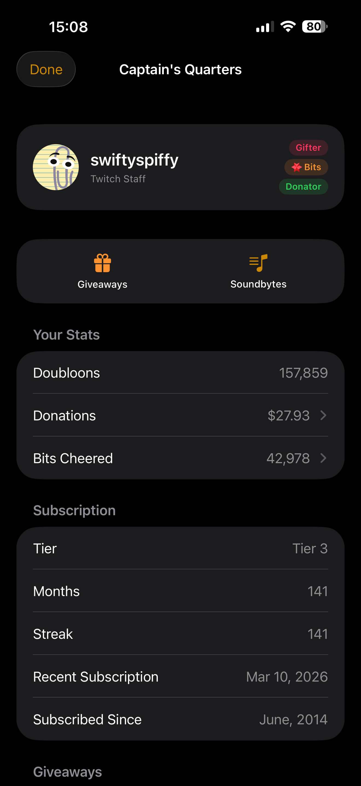
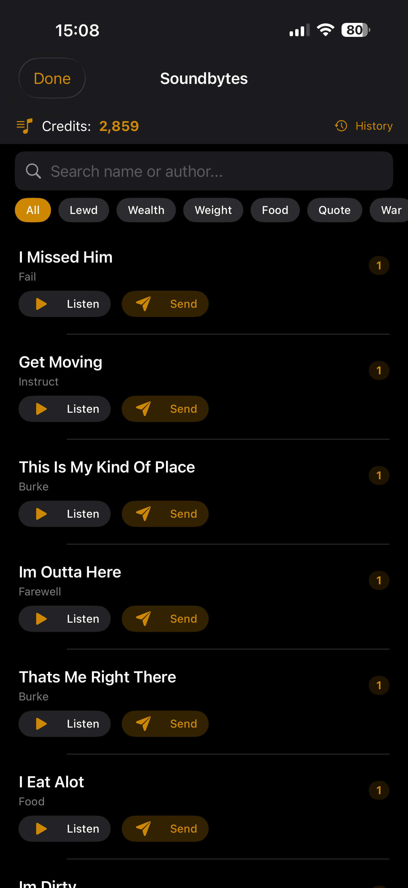
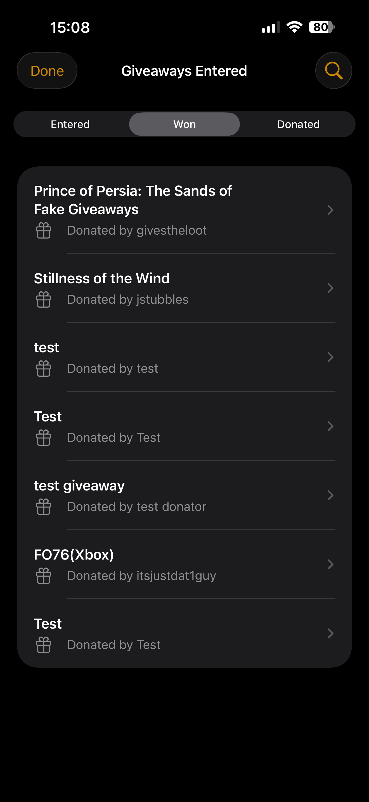
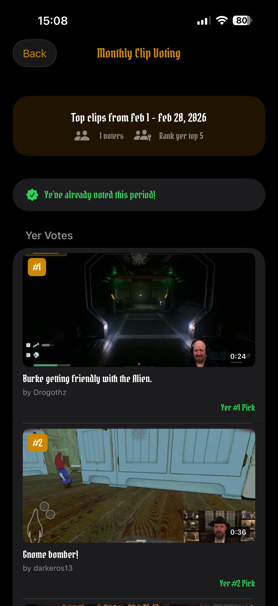
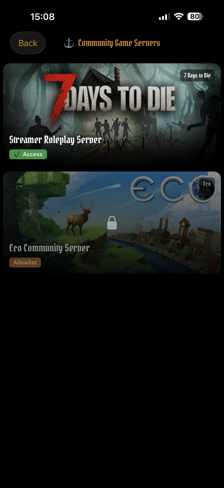
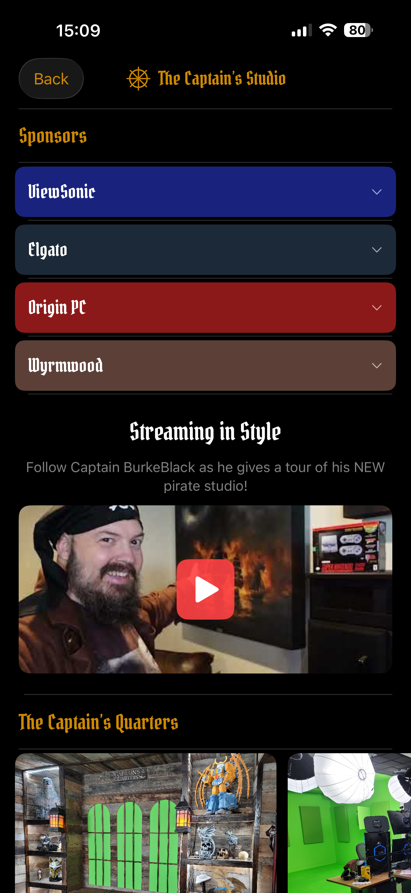
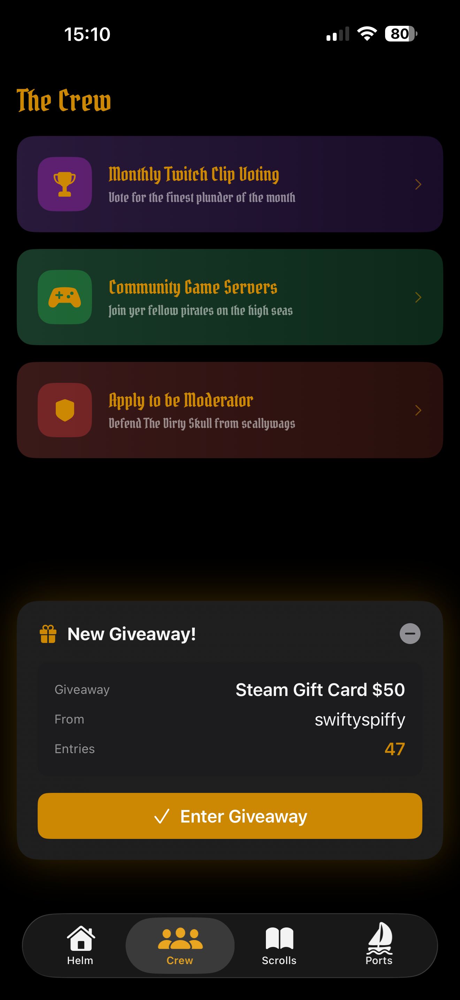

<p align="center">
  
</p>

<h1 align="center">The Dirty Skull</h1>

<p align="center">
  The official companion app for <a href="https://twitch.tv/burkeblack">BurkeBlack's</a> Twitch community.
</p>

<p align="center">
  <a href="https://apps.apple.com/us/app/dirty-skull/id6761034588">
    
  </a>
  &nbsp;&nbsp;
  <a href="https://play.google.com/store/apps/details?id=com.swiftyspiffy.burkeblackapp">
    
  </a>
</p>

<p align="center">
  <a href="https://burkeblack.tv/app/ios/">Website</a> &middot;
  <a href="https://github.com/swiftyspiffy/BurkeBlackApp-Android">Android Repo</a> &middot;
  <a href="https://discord.gg/burkeblack">Discord</a> &middot;
  <a href="https://twitch.tv/burkeblack">Twitch</a>
</p>

---

## What Is This?

**The Dirty Skull** is the official mobile app for [BurkeBlack](https://twitch.tv/burkeblack), a full-time variety streamer on Twitch. It gives his community - The Pirates - a way to stay connected to the stream, participate in events, and manage community features, all from their phone.

Whether you're a long-time crew member or a new viewer, the app gives you everything you need at your fingertips.

## Screenshots

<p align="center">
  
  
  
  
</p>
<p align="center">
  
  
  
  
</p>

## Features

- **Live Stream Status** - see when BurkeBlack is live, with a countdown to the next stream. Tap to jump straight to Twitch.
- **Real-Time Giveaways** - enter giveaways directly from the app as they happen on stream. Watch the timer and see who wins.
- **Soundbytes** - browse, preview, and send soundbytes to the stream. Filter by genre, search by name, and track your credits.
- **Your Stats** - track doubloons, donations, bits cheered, subscription history, and giveaway wins all in one place.
- **Badges** - earn badges for being a follower, subscriber, gifter, bits supporter, and donator.
- **Clip Voting** - vote and rank your favorite clips each month.
- **Community Game Servers** - browse community-run game servers with connection details and access requirements.
- **Home Screen Widgets** - crew stats and stream status widgets to keep up at a glance.
- **Mod Panel** - moderators get a full toolkit: manage commands, timed messages, giveaways, soundbytes, and more.

## Download

The app is available for free on the [App Store](https://apps.apple.com/us/app/dirty-skull/id6761034588) and [Google Play](https://play.google.com/store/apps/details?id=com.swiftyspiffy.burkeblackapp).

Having trouble? Use the in-app feedback form (**Account > Send Feedback**) to report issues and include diagnostics.

---

## Contributing

Interested in contributing? Great! Here's how to get started.

This is the **iOS** repository. The Android app lives at [BurkeBlackApp-Android](https://github.com/swiftyspiffy/BurkeBlackApp-Android).

### Requirements

- iOS 17.0+
- Xcode 16.0+
- Swift 5.9+
- [XcodeGen](https://github.com/yonaskolb/XcodeGen) (for project file generation)

### Getting Started

```bash
# Clone the repo
git clone https://github.com/swiftyspiffy/BurkeBlackApp-iOS.git
cd BurkeBlackApp

# Generate the Xcode project
xcodegen generate

# Open in Xcode
open BurkeBlackApp.xcodeproj
```

> **Note:** The app communicates with `api.burkeblack.tv` for backend data. Public endpoints (stream status, home data) work without authentication. Features like giveaways, soundbytes, and account stats require a Twitch login.

### Architecture

- **SwiftUI** - fully native UI with `NavigationStack`, `TabView`, and modern SwiftUI patterns
- **MVVM** - ViewModels manage state and business logic
- **Swift Concurrency** - `async`/`await` throughout, `@MainActor` isolation, `actor`-based services
- **WebSocket** - native `URLSessionWebSocketTask` for real-time giveaway events with automatic reconnection
- **WidgetKit** - home screen widgets with App Group data sharing
- **Authentication** - Twitch OAuth via `ASWebAuthenticationSession` with backend token exchange
- **Security** - bearer tokens stored in iOS Keychain, not UserDefaults

### Project Structure

```
BurkeBlackApp/
├── BurkeBlackAppApp.swift          # App entry point
├── Models/
│   └── Models.swift                # Data models
├── Services/
│   ├── APIService.swift            # Public API client
│   ├── TwitchAuthService.swift     # OAuth & authenticated API
│   ├── GiveawayWebSocket.swift     # Real-time WebSocket manager
│   ├── AccountViewModel.swift      # User session & dashboard
│   └── ...                         # Other view models & services
├── Views/
│   ├── ContentView.swift           # Root TabView
│   ├── HomeView.swift              # Stream status & countdown
│   ├── AccountView.swift           # Login & dashboard
│   ├── GiveawayPopupView.swift     # Real-time giveaway overlay
│   ├── ModPanelView.swift          # Moderator tools
│   └── ...                         # Other views
└── Assets.xcassets/                # Icons, images, equipment photos

BurkeBlackWidget/
├── BurkeBlackWidget.swift          # Widget extension (crew stats, stream status)
└── Assets.xcassets/                # Widget assets

BurkeBlackNotificationService/
└── NotificationService.swift       # Rich push notification support
```

### How to Contribute

1. Fork the repository
2. Create a feature branch (`git checkout -b feature/your-feature`)
3. Make your changes
4. Submit a pull request with a clear description of what you changed and why

For bug reports or feature requests, please [open an issue](https://github.com/swiftyspiffy/BurkeBlackApp-iOS/issues).

---

## Developer

Built by [swiftyspiffy](https://github.com/swiftyspiffy) for the BurkeBlack community.

[Twitch](https://twitch.tv/swiftyspiffy) · [Twitter / X](https://twitter.com/swiftyspiffy) · [GitHub](https://github.com/swiftyspiffy)
